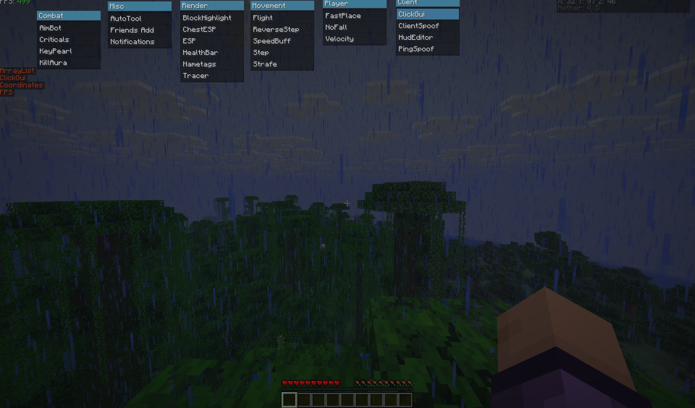

# OxeVy

<div align="center">
  
  **A AI based hackclient on OyVey-Ported**
  
  Built with: ChatGPT • DeepSeek • OpenCode • Gemini • Cursor
  
  [](https://opensource.org/licenses/MIT)
  []()
  
</div>

## Preview

<div align="center">
  
  ### OyVey-Ported
  
  
  ### OxeVy UI
  
  
  
</div>

## Features

- **Modern UI/UX** - Redesigned interface with improved visuals and usability
- **Multi-AI Integration** - Built using insights from leading AI platforms
- **Performance Optimized** - Enhanced version of the original OyVey client

## Technologies Used

| AI Tool | Purpose |
|---------|---------|
| ChatGPT | Code optimization and feature implementation |
| DeepSeek | AI logic and decision making |
| OpenCode | Open-source best practices |
| Gemini | UI/UX improvements |
| Cursor | Development assistance |

## Installation

1. Clone the repository
   ```bash
   git clone https://github.com/daneq1/oxevy.git
